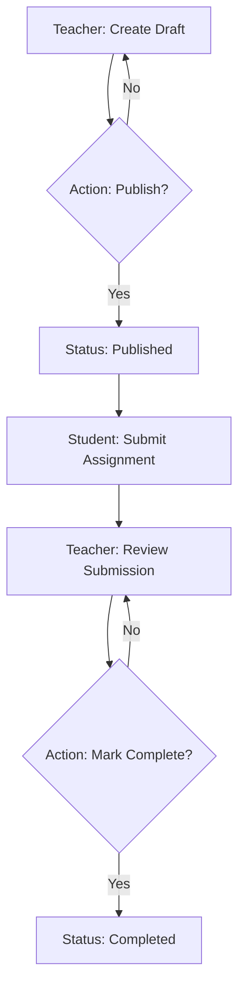

# Tailwebs - Assignment Workflow Portal (API)

A robust, role-based REST API built with Node.js and Express to manage the end-to-end assignment lifecycle between teachers and students.

## 🚀 Features

- **RBAC (Role-Based Access Control)**: Secure JWT-based authentication with distinct permissions for Teachers and Students.
- **Assignment Lifecycle**: Manage states from `Draft` ➔ `Published` ➔ `Completed`.
- **Submission System**: Track student responses and file metadata.
- **Security**: Password simulation and protected route middleware.

## 🛠️ Tech Stack

| Technology | Purpose |
| :--- | :--- |
| **Node.js** | Runtime Environment |
| **Express.js** | Web Framework |
| **JWT** | Secure Authentication |
| **Morgan** | Request Logging |
| **Cors** | Cross-Origin Resource Sharing |

## 📊 Assignment Workflow



## 📋 API Endpoints

### Authentication
| Method | Endpoint | Description |
| :--- | :--- | :--- |
| `POST` | `/api/auth/signup` | Register a new user (Teacher/Student) |
| `POST` | `/api/auth/login` | Authenticate user and receive JWT |

### Assignments
| Method | Endpoint | Auth | Description |
| :--- | :--- | :--- | :--- |
| `GET` | `/api/assignments` | JWT | Get all assignments (filtered by role) |
| `POST` | `/api/assignments` | Teacher | Create a new assignment |
| `PUT` | `/api/assignments/:id` | Teacher | Update assignment details or status |
| `DELETE` | `/api/assignments/:id` | Teacher | Remove a draft assignment |

### Submissions
| Method | Endpoint | Auth | Description |
| :--- | :--- | :--- | :--- |
| `GET` | `/api/submissions/:assignmentId` | Teacher | View all submissions for an assignment |
| `POST` | `/api/submissions` | Student | Submit work for a published assignment |

## ⚙️ Local Setup

1. **Install Dependencies**:
   ```bash
   npm install
   ```

2. **Configure Environment**:
   Create a `.env` file in the root:
   ```env
   PORT=5001
   JWT_SECRET=your_secret_key
   ```

3. **Start Development Server**:
   ```bash
   npm run dev
   ```

## ⚠️ Assumptions & Constraints

- **In-Memory Store**: This demo uses a volatile in-memory store. Data will reset if the server restarts.
- **File Uploads**: Files are simulated using metadata (name, size, type). Local binary storage is not implemented in this version.
- **Passwords**: Currently stored as plain text for ease of testing in this assessment.

## 🌐 Deployment (Vercel)

The backend is configured for **Vercel Serverless**. The `vercel.json` ensures all requests are routed through the Express app.

```json
{
  "version": 2,
  "builds": [{ "src": "src/index.js", "use": "@vercel/node" }],
  "routes": [{ "src": "/(.*)", "dest": "src/index.js" }]
}
```
